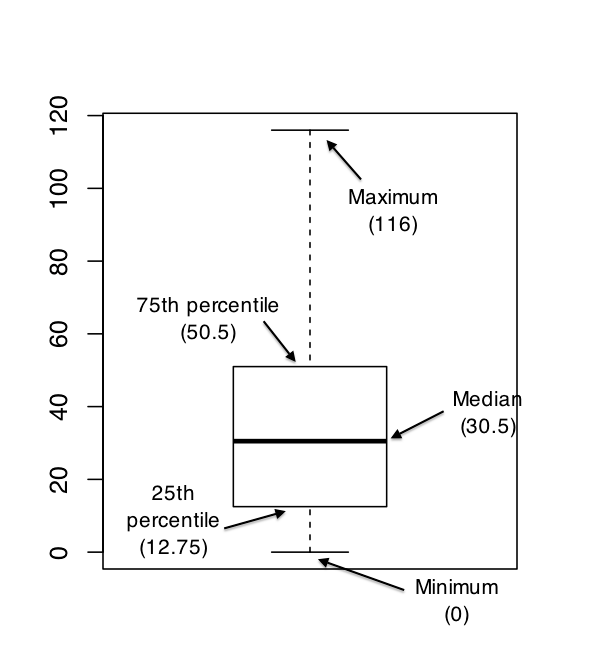

# Drawing graphs.

**Learning objectives:**

- Learn how to make Exploratory Data Analysis 
- use of the `plot()` function and `{ggplot2}` package

## Overview

Exploratory data analysis is one of the most important part of the data analysis.

The book expands on using the base r `plot()` function for **data visualization**. Here we have a look at how to make the same plots with `{ggplot2}` and the `{tidyverse}` syntax.


## John Snow’s cholera project

```{r message=FALSE,warning=FALSE}
library(tidyverse)
```


```{r}

library(HistData)
# ?HistData
SnowMap()
```

```{r}
data("Snow.deaths")
Snow.deaths%>%
  ggplot(aes(x,y))+
  geom_point()
```


```{r}
data("Snow.deaths")
data("Snow.streets")

plot(Snow.deaths[,c("x","y")], 
     col="red", pch=19, cex=.7)

slist <- split(Snow.streets[,c("x","y")],
               as.factor(Snow.streets[,"street"]))
?invisible
invisible(lapply(slist, lines, col="black"))
```


## Data used for making the plots

- Fibonacci sequence
- aflsmall
- afl2
- parenthood
- afl.finalists


A simple intro to how to make a plot with the Fibonacci sequence data:
```{r}
Fibonacci <- c( 1,1,2,3,5,8,13 )
plot( Fibonacci )
```


## Histograms

```{r}
load( "./data/aflsmall.Rdata" )
# install.packages("lsr")
library(lsr)
who()
```

```{r}
afl.margins[1:10]
```
```{r}
afl.margins_df <- data.frame(afl.margins=afl.margins)


afl.margins_df%>%
  ggplot(aes(x=afl.margins))+
  geom_histogram(binwidth = 8,color="white",fill="steelblue")
```


## Stem and Leaf plots

    ?stem()
    
```{r}
# ?stem()
x <- c( 1,1,2,3,5,8,13 )
stem(x, 
     scale = 2, 
     width = 10, atom = 1e-08)
```


```{r}
islands_df <- data_frame(values=islands,islands=names(islands))
```

```{r}
islands_df%>%
  ggplot(aes(values))+
  geom_histogram()+
  coord_flip()+
  scale_x_reverse()
```


```{r}
stem(islands)
stem(log10(islands))
```


```{r}
stem( afl.margins )
```


## Boxplots
```{r}
summary( afl.margins )
```
```{r}
afl.margins_df %>%
  ggplot(aes(y=afl.margins))+
  geom_boxplot()
```

```{r}

```
```{r}
load( "./data/aflsmall2.Rdata" )
who( TRUE )
```

```{r}
head( afl2 )
```
```{r fig.cap="AFL winning margins for the 24 years from 1987 to 2010 inclusive"}
afl2_df <- data.frame(afl2)

afl2_df %>%
  ggplot(aes(x=year,
             y=margin,group=year))+
  geom_boxplot()+
  geom_hline(aes(yintercept=(mean(margin))),color="red")
```

## Scatterplots
```{r}
load( "./data/parenthood.Rdata" )
parenthood%>%head
```

```{r}
parenthood%>%
  ggplot(aes(x=dan.sleep,y=dan.grump))+
  geom_point()
```

```{r}
parenthood%>%
  ggplot(aes(x=dan.sleep,y=dan.grump))+
  geom_point(shape=21,stroke=0.5,fill="pink")+
  geom_smooth(method = "lm",se=F)+
  tvthemes::theme_avatar()
  # ggthemes::theme_fivethirtyeight()
```


```{r}
cor(x=parenthood)
```

```{r}
pairs(parenthood)
```
```{r}
pairs( formula = ~ dan.sleep + baby.sleep + dan.grump,
       data = parenthood)
```

## Bar Graphs

    ?tabulate()
    
```{r}
freq <- tabulate( afl.finalists )
freq
```


```{r}
afl.finalists_df <- data.frame(afl.finalists)

afl.finalists_df %>% count(afl.finalists)
```
```{r}
afl.finalists_df %>%
  count(afl.finalists) %>%
  ggplot(aes(x=afl.finalists,y=n))+
  geom_col()+
  theme(axis.text.x = element_text(angle = 45))
```

```{r}
afl.finalists_df %>%
  count(afl.finalists) %>%
  ggplot(aes(y=fct_reorder(afl.finalists,n),x=n))+
  geom_col()+
  labs(y="afl.finalists")
```


## Conclusions

More features can be added specifying:

- theme() options
- saving as png/jpeg file


## Meeting Videos

### Cohort 1

`r knitr::include_url("https://www.youtube.com/embed/URL")`

<details>
<summary> Meeting chat log </summary>

```
LOG
```
</details>
