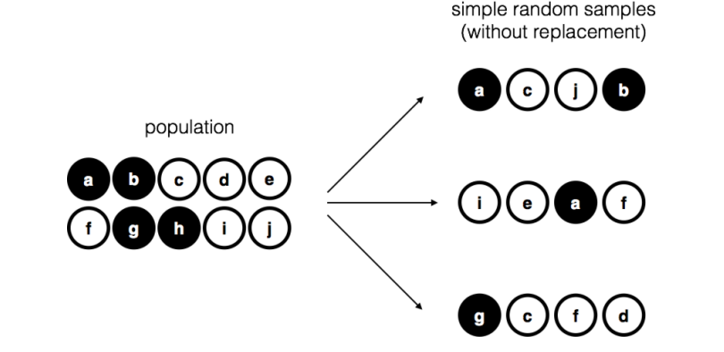
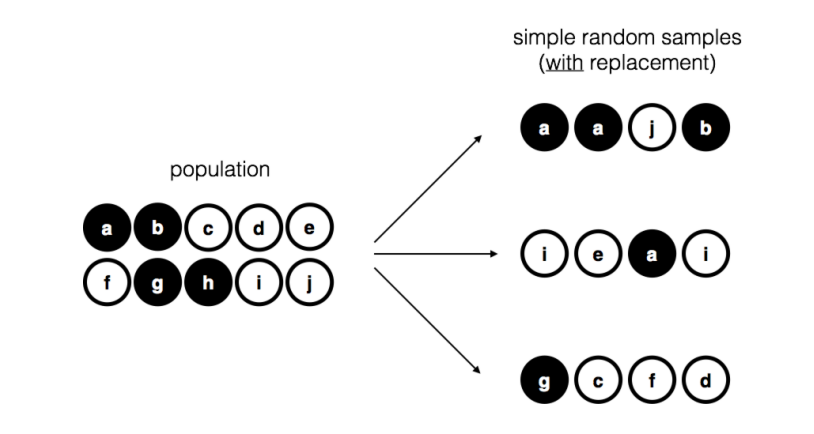

# Estimating unknown quantities from a sample.

**Learning objectives:**

-   Sampling
-   Estimating
-   examples

## Sampling and Estimations

{width="400"} {width="400"}

```{r message=FALSE,warning=FALSE}
library(tidyverse)
library(HistData)
cholera <- HistData::Cholera
#  cholera%>%glimpse
```

```{r}
cholera%>%dim
```

```{r}
# cholera%>%names
```

```{r}
cholera%>%sample(size=10,replace = FALSE)%>%head
```

```{r}
cholera_1000 <- cholera%>%sample(size=1000,
                                 replace = TRUE)
# cholera_1000 %>% names
```


```{r}
deaths <- cholera$cholera_deaths
length(deaths)
# sample(deaths,size = 100,replace = T)
```


### Sample statistics

```{r}
cholera%>%
  select(cholera_deaths)%>%summary()
```


```{r}
cholera%>%
  group_by(district)%>%
  reframe(avg=mean(cholera_deaths))%>%
  select(district,avg)
```


```{r}
cholera%>%#names
  ggplot(aes(cholera_deaths))+
  geom_density()+
  geom_vline(aes(xintercept=mean(cholera_deaths)),
             color="red",linewidth=0.5)+
  geom_text(aes(x=mean(cholera_deaths)+100,y=0.0015,
                label="Mean"))+
    geom_vline(aes(xintercept=sd(cholera_deaths)),
             color="darkred",linewidth=0.5)+
  geom_text(aes(x=mean(cholera_deaths)-100,y=0.0010,
                label="SD"))+
    ggthemes::theme_fivethirtyeight()
```

```{r}
cholera%>%#names
  ggplot(aes(x=cholera_deaths,fill=water))+
    geom_histogram(position="stack",
                   bins=10,color="white")+
  labs(x="Deaths")+
  ggthemes::scale_fill_fivethirtyeight()+
  ggthemes::theme_fivethirtyeight()+
  theme(axis.title.x = element_text())
```

### The IQ example

```{r}
IQ <- rnorm(n = 10000, mean = 100, sd = 15) # generate IQ scores
IQ <- round(IQ) # IQs are whole numbers!
head(IQ)
```

To make this with ggplot2:

-   geom_histogram(aes(y=..density..), position="stack", fill="steelblue", bins=30,color="white")
-   stat_function(fun = dnorm, color="green", args = list(mean = mean(IQ), sd = sd(IQ)))

```{r}
tibble(IQ=IQ,
       dist=dnorm(x=IQ,mean = mean(IQ),sd = sd(IQ) ))
```

```{r}
tibble(IQ=IQ,
       dist=dnorm(x=IQ,mean = mean(IQ),sd = sd(IQ) ))%>%
  summary()
```


```{r}
tibble(IQ)%>%#names
  ggplot(aes(x=IQ))+
  geom_histogram()
```

```{r}
density(IQ)
```

```{r}
tibble(IQ)%>%#names
  ggplot(aes(x=IQ))+
  geom_histogram(aes(y =..density..),
                 #position="stack",
                 fill="steelblue",
                 bins=30,
                 color="white")+
 stat_function(fun = dnorm, 
               color="green", 
               args = list(mean = mean(IQ), sd = sd(IQ)))+
  geom_vline(aes(xintercept=mean(IQ)),
             color="red",linewidth=0.5)+
  geom_text(aes(x=mean(IQ)+10,y=0.02,
                label="Mean"))+
  ggthemes::scale_fill_fivethirtyeight()+
  ggthemes::theme_fivethirtyeight()
```

```{r}
tibble(IQ=sample(IQ,size = 10000*3,replace = T))%>%#names
  ggplot(aes(x=IQ))+
  geom_histogram(aes(y=..density..),
                 position="stack",
                   fill="steelblue",
                   bins=30,color="white")+
 stat_function(fun = dnorm, 
               color="green", 
               args = list(mean = mean(IQ), sd = sd(IQ)))+
  geom_vline(aes(xintercept=mean(IQ)),
             color="red",linewidth=0.5)+
  geom_text(aes(x=mean(IQ)+10,y=0.02,
                label="Mean"))+
  ggthemes::scale_fill_fivethirtyeight()+
  ggthemes::theme_fivethirtyeight()
```

```{r}
width <- 6
    height <- 6 
    
# parameters of the beta
    a <- 2
    b <- 1
    
# mean and standard deviation of the beta
    s <- sqrt( a*b / (a+b)^2 / (a+b+1) )
    m <- a / (a+b)
```

```{r}
# define function to draw a plot
    plotOne <- function(n,N=50000) {
        
        # generate N random sample means of size n
        X <- matrix(rbeta(n*N,a,b),n,N)
        X <- colMeans(X)
        
        # plot the data
        hist( X, breaks=seq(0,1,.025), border="white", freq=FALSE,
            col="grey",
            xlab="Sample Mean", ylab="", xlim=c(0,1.2),
            main=paste("Sample Size =",n), axes=FALSE,
            font.main=1, ylim=c(0,5)
        )
        box()
        axis(1)
        #axis(2)
        
        # plot the theoretical distribution
        lines( x <- seq(0,1.2,.01), dnorm(x,m,s/sqrt(n)), 
            lwd=2, col="black", type="l"
        )
    }
    
    for( i in c(1,2,4,8)) {
        plotOne(i)}
```

If the population distribution has mean $\mu$ and standard deviation $\sigma$, then the sampling distribution of the mean also has mean $\mu$, and the standard error of the mean is: $$SEM=\frac{\sigma}{\sqrt(N)}$$


## Meeting Videos

### Cohort 1

`r knitr::include_url("https://www.youtube.com/embed/URL")`

<details>

<summary>Meeting chat log</summary>

```         
LOG
```

</details>
