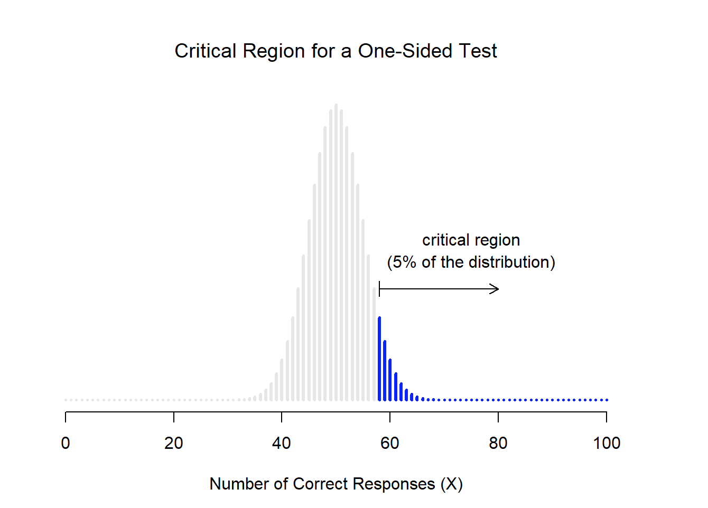
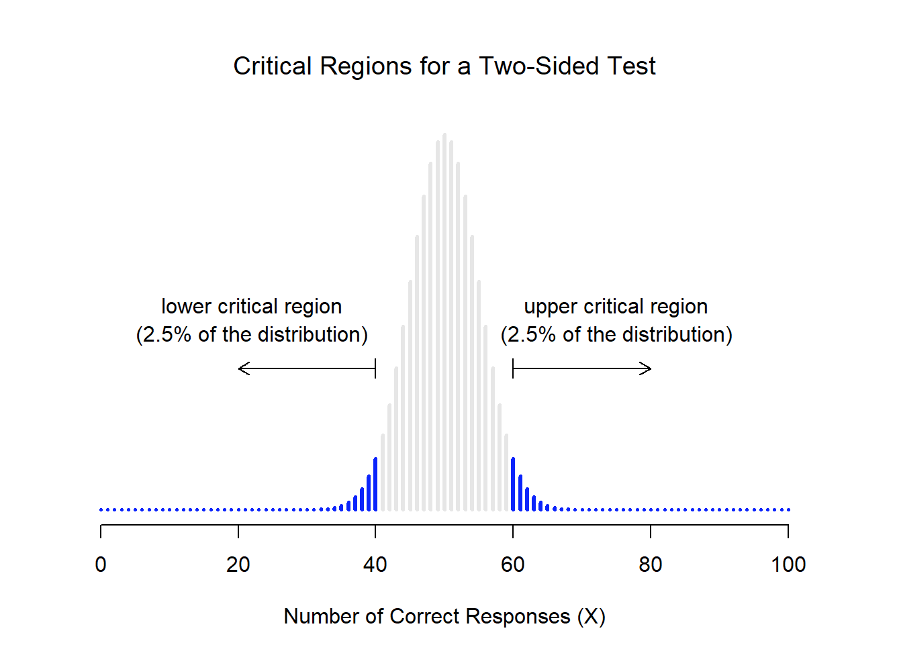
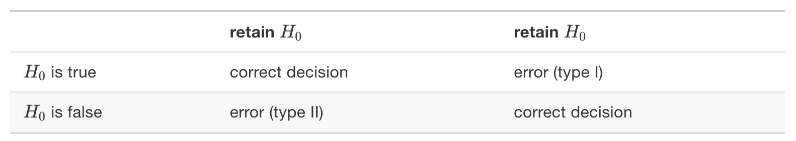

# Hypothesis testing.

**Learning objectives:**

- What is Hypothesis testing
- How to set the hypotheses
- Evaluate the results of a statistical hypothesis testing 


## What is Hypothesis testing

`Hypothesis testing` is a statistical method used to determine if there's enough evidence in a sample of data to draw conclusions about a population. 

It helps you make informed decisions about whether a specific assumption or claim about a population is likely to be true or not. 

In simple terms, it involves setting up two competing statements, the `null hypothesis (H0)` and the `alternative hypothesis (Ha)`, and then collecting and analyzing data to see which statement is more likely to be supported by the evidence.


## How to set the hypotheses


- `Null Hypothesis (H0)`: This is the default assumption or statement that there is no effect or no difference. It represents the status quo.
- `Alternative Hypothesis (Ha)`: This is the statement you want to test, suggesting that there is an effect or a difference.

$$\left\{\begin{matrix}
 H_0 & \text{Null Hypothesis} \\ 
 H_a & \text{Alternative Hypothesis}
\end{matrix}\right.$$

Setting a threshold:

- One side
$$\left\{\begin{matrix}
 H_0 & \alpha \leq 0.05 \\ 
 H_a & \alpha > 0.5
\end{matrix}\right.$$
<center></center>
- Two sides
$$\left\{\begin{matrix}
 H_0 & \alpha = 0.05 \\ 
 H_a & \alpha \neq 0.05
\end{matrix}\right.$$
<center></center>


## Case Study: Students heights

Suppose we want to test if the average height of a sample of students is different from the population average height (which is 165 cm).


### Hypotheses

- H0: The average height of students is 165 cm.
- Ha: The average height of students is not equal to 165 cm.

$$\left\{\begin{matrix}
 H_0 & \mu=165cm \\ 
 H_a & \mu \neq 165cm
\end{matrix}\right.$$

### Sample data (heights of students)

```{r}
heights <- c(160, 168, 162, 170, 155, 175, 158, 172, 166, 180)
```


### Choose a Significance Level (α)

The `significance level (α)` is the `threshold` you set to determine what constitutes strong enough evidence to reject the null hypothesis. Common values for α are 0.05 or 0.01.

Significance level
```{r}
alpha <- 0.05
```


### Perform the Hypothesis Test

You can use statistical tests appropriate for your data type and research question. In this example, you can use a t-test to compare the sample mean to the population mean.


Perform t-test
```{r}
t_test <- t.test(heights, mu = 165)
```


### Make a Decision

- If the p-value (probability value) obtained from the test is less than α (p < α), you reject the null hypothesis. This means you have evidence to support the alternative hypothesis.

- If p-value ≥ α, you fail to reject the null hypothesis. This means you don't have enough evidence to support the alternative hypothesis.


Get the p-value from the test
```{r}
p_value <- t_test$p.value

# Make a decision
if (p_value < alpha) {
  cat("Reject H0: There is enough evidence to suggest that the average height is different from 165 cm.\n")
} else {
  cat("Fail to reject H0: There is not enough evidence to suggest that the average height is different from 165 cm.\n")
}
```


## Evaluate the results of a statistical hypothesis testing


**Type I and Type II errors**

<center></center>

#### Case Study: medical diagnostic test

Suppose we have a new medical test designed to detect a particular disease, and we want to assess its accuracy.

**Scenario:**

- Null Hypothesis (H0): The patient does not have the disease

- Alternative Hypothesis (Ha): The patient has the disease


`Simulate test results for two groups`: patients without the disease and patients with the disease. Then, perform a hypothesis test based on the test results and evaluate Type I and Type II errors.


Simulate data
```{r}
set.seed(123)
```

True disease status (0 for no disease, 1 for disease)
```{r}
population_without_disease <- rbinom(1000, size = 1, prob = 0.1)
population_with_disease <- rbinom(1000, size = 1, prob = 0.8)
```

```{r}
population_without_disease
```

Assuming a Type I error rate (α) of 0.05 and a Type II error rate (β) of 0.2

```{r}
alpha <- 0.05
beta <- 0.2
```

```{r}
test_results_without_disease <- rbinom(1000, size = 1, prob = alpha) * (1 - population_without_disease)

test_results_with_disease <- rbinom(1000, size = 1, prob = 1 - beta) * population_with_disease
```


##### Hypothesis testing

```{r}
result <- t.test(test_results_with_disease, test_results_without_disease)
result
```


##### Determine Type I and Type II errors
```{r}
cutoff <- qnorm(1 - alpha)
```

 # Calculate the critical value for a Type I error

`True positive`: Patients with the disease correctly identified
```{r}
true_positive <- sum(test_results_with_disease == 1)
```


`False positive`: Patients without the disease incorrectly identified as having it
```{r}
false_positive <- sum(test_results_without_disease == 1)
```


`True negative`: Patients without the disease correctly identified as not having it
```{r}
true_negative <- sum(test_results_without_disease == 0)
```


`False negative`: Patients with the disease incorrectly identified as not having it
```{r}
false_negative <- sum(test_results_with_disease == 0)
```


**Calculate Type I and Type II error rates**
```{r}
type_i_error_rate <- false_positive / (false_positive + true_negative)
type_ii_error_rate <- false_negative / (false_negative + true_positive)
```


```{r}
cat("Type I Error Rate (False Positive Rate):", type_i_error_rate, "\n")
cat("Type II Error Rate (False Negative Rate):", type_ii_error_rate, "\n")
```


## Conclusions

The interpretation of the results based on whether the p-value is less than your chosen significance level (α), will make you conclude if there is enough evidence to support the evidence or not.

In addition the two types of errors represents the percentage of the population who were correctly/incorrectly identified answering the research question.

The specific values of Type I and Type II errors will vary based on the simulation, but by adjusting the parameters in the code, you can explore different scenarios and see how changes in test sensitivity (1 - β) and specificity (1 - Type I error rate) affect these error rates.

Furthermore, two distinct approaches to hypothesis testing exist: `Neyman`'s approach, which emphasizes controlling Type I errors and facilitating binary decisions while optimizing test power, and `Fisher`'s approach, which prioritizes assessing the strength of evidence against the null hypothesis, often employing p-values and confidence intervals, without rigidly controlling Type I error rates. Researchers select the most suitable approach based on their research objectives and priorities, often incorporating both perspectives when conducting and interpreting hypothesis tests.


## Meeting Videos

### Cohort 1

`r knitr::include_url("https://www.youtube.com/embed/URL")`

<details>
<summary> Meeting chat log </summary>

```
LOG
```
</details>
